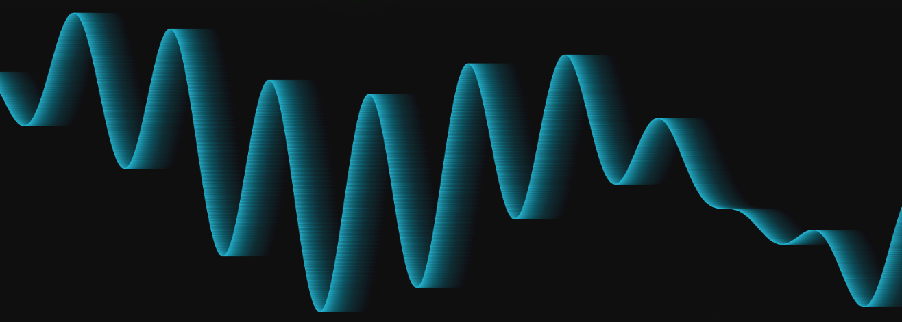
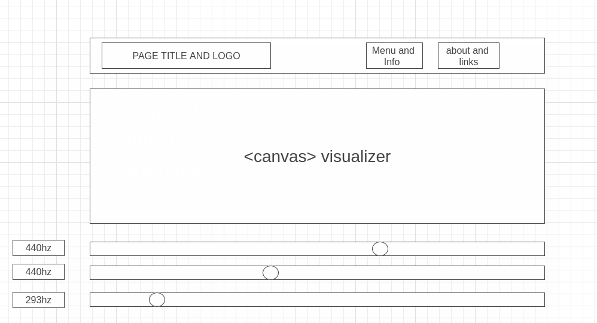

# JavaScript Oscilloscope

## Background

A program where the user can affect and play with tones generated with the AudioConetextAPI. The user will be able to adjust the pitch and quality of individual oscillator nodes as well as add, subtract, mute and unmute. There will also be a visualization component in which the represented sine wave will be drawn in a visualizer. The visualizer will be a be a live representation and will redraw to represent a new pitch as the user interacts with the program. As more pitches are added, the drawn wave will be the resultant superposition of the combined waves.

## Functionality & MVPs

User will be able to:

- [] Dynamically create audio nodes and UI controls for start, stop, and slider for pitch adjustments, volume
- [] See visualization of sounds they create.
- [] Interact with preset functions which produce nodes and select sounds such as chords, reset to single pitch, and other potential configurations
- [] Access information which serves to interpret and elaborates on the program and the processes

## Wireframes

## Architecture & Technologies

- `Javascript`
- `AudioContext API`
- `Canvas API`
- `webpack`

This applicatin will incorporate the `AudioContext API` to generate sounds, in particular the `OscillatorNode` which allows for the production of a generated pitch.

In addtion to the `AudioContext API`, this application will incorporate the `Canvas API` as a means of drawing visual representation of the generated waves.

File structure and primary components:

- `oscillator.js` - contains code related to creation/destruction of nodes as well as methods for adjusting their properties.
- `canvas.js` - contains the basic organization for the `<canvas>` element including size, shape, and draw properites.
- `waves.js` - contains the methods for calculating the waves to be drawn on the `<canvas>` element, utilizing properties stored on the individual nodes.

## Implementation Timeline

- Day 1 - Build base slate for page. Creation of audio nodes with controls.
- Day 2 - `canvas` draw functionality and begin work on wave calculating methods
- Day 3 - wave calculations and connecting to `canvas` for visualization
- Day 4 - HTML, CSS, explanation information research and site organization, info-modals, links,
- Day 5 - testing and debugging and final touch-ups

## Bonus Features & Future Project Goals

- Incorporate alternative visualization methods
- Expand user controls over affects and sound.
